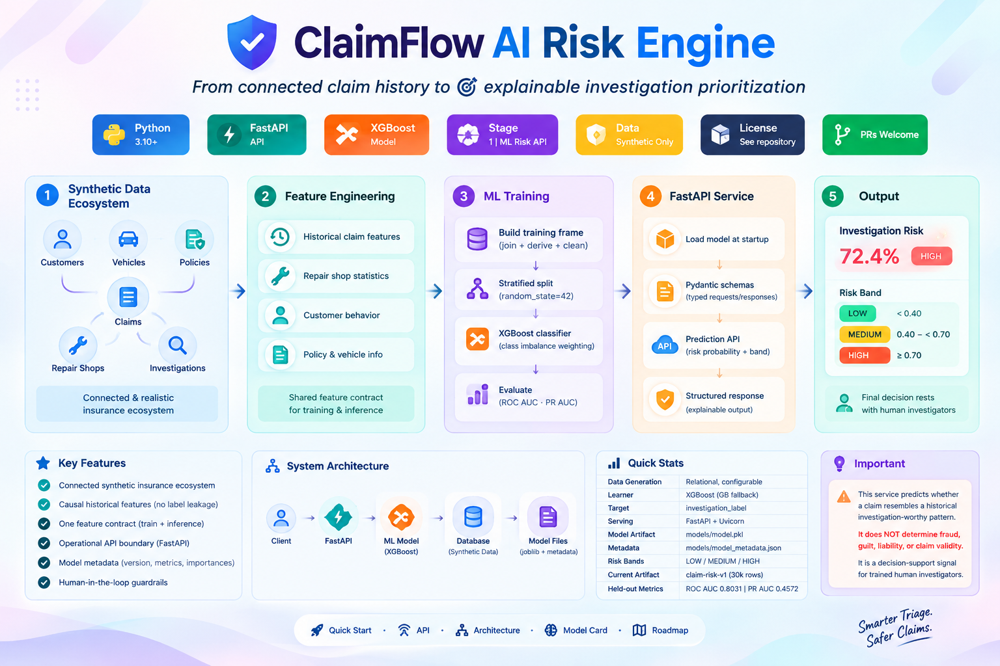
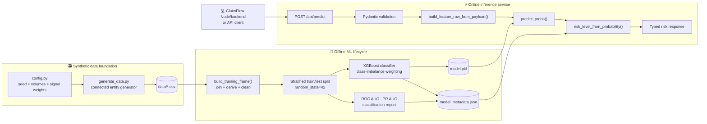
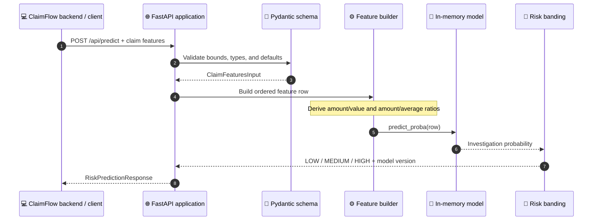
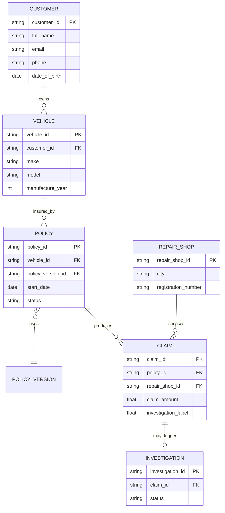
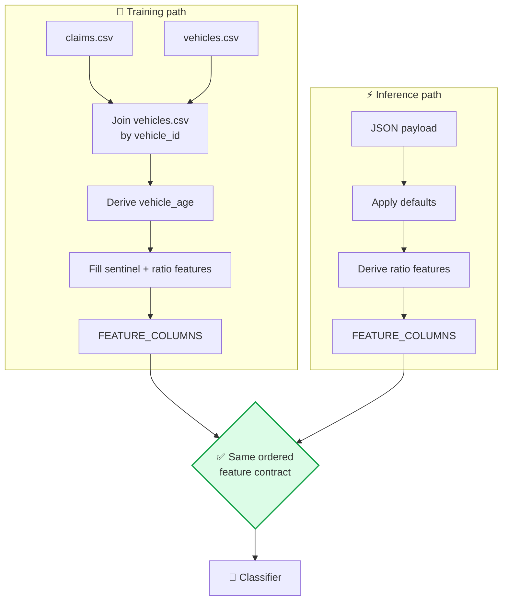
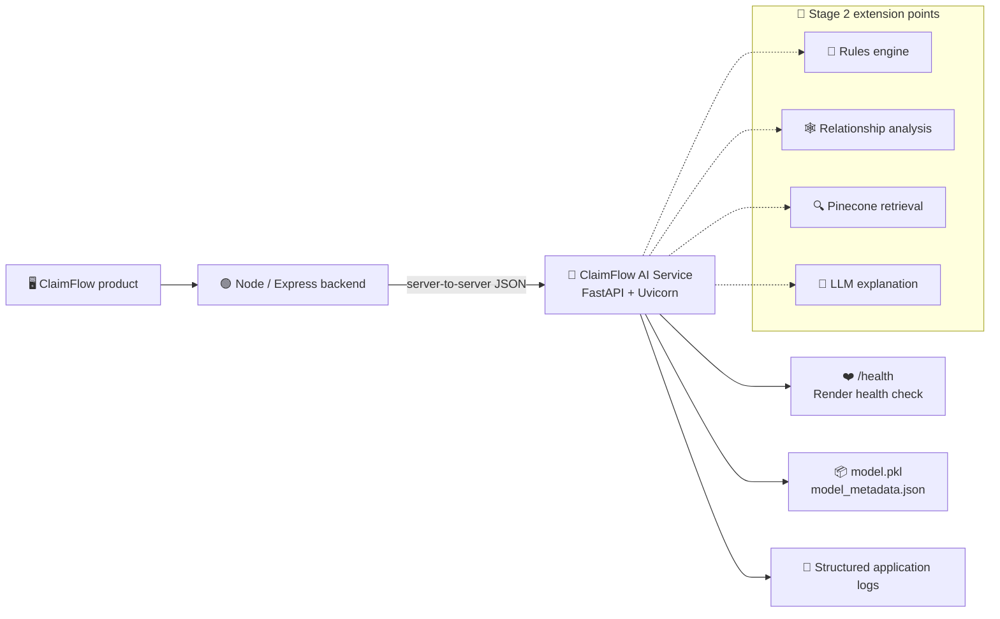
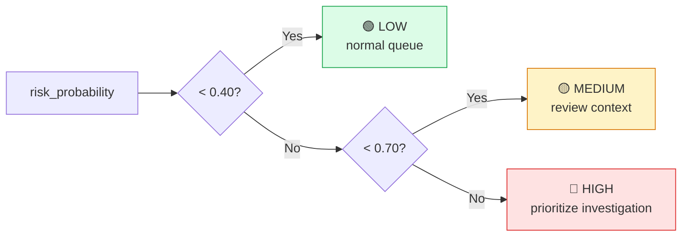
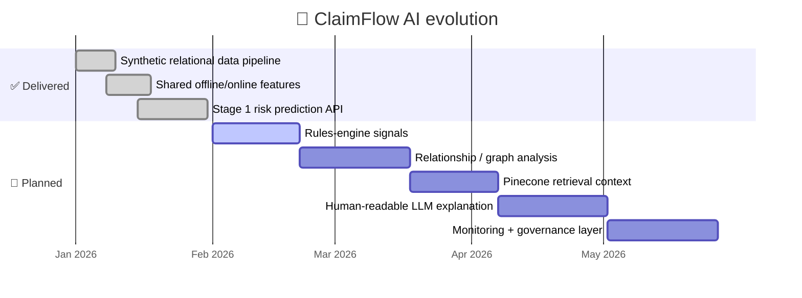

<div align="center">

# 🛡️ ClaimFlow AI Risk Engine

### 🔗 From connected claim history to 🎯 explainable investigation prioritization

### 🔗 [**https://claimflow-7qvu.onrender.com**](https://claimflow-7qvu.onrender.com)

<br/>

[](https://www.python.org/)
[](https://fastapi.tiangolo.com/)
[](https://xgboost.readthedocs.io/)
[](#-scope-and-roadmap)
[](#-data-and-ethics)
[](../../)
[](#-contributing)



**🤖 ClaimFlow AI Service** is a production-shaped machine-learning component for insurance claim triage. It converts claim-level and historical behavioral signals into a calibrated-looking **investigation-risk probability** and a simple operational risk band — while keeping the final decision with a 👤 human investigator.

<p>
  <a href="#-quick-start">🚀 Quick start</a> ·
  <a href="#-api-reference">📡 API</a> ·
  <a href="#-architecture">🏗️ Architecture</a> ·
  <a href="#-model-card">🧠 Model card</a> ·
  <a href="#-scope-and-roadmap">🗺️ Roadmap</a>
</p>

</div>

> [!IMPORTANT]
> ⚠️ This service predicts whether a claim resembles a historical **investigation-worthy pattern**. It does **not** determine fraud, guilt, liability, or claim validity. It is a decision-support signal for trained human investigators.

---

## ✨ Why this project is different

Many demo fraud models jump straight from a flat CSV to a classifier. ClaimFlow is designed as a small, coherent ML **product** instead:

- 🌐 **Connected synthetic insurance ecosystem** — customers, vehicles, policies, claims, repair shops, and investigations are generated as related records.
- ⏳ **Causal historical features** — prior-claim and repair-shop statistics are computed from information available *before* the current claim, reducing label leakage during data generation.
- 📐 **One feature contract** — the same feature definitions are shared by offline training and online inference.
- 🔌 **Operational API boundary** — the model is loaded once at startup and served behind typed FastAPI request/response schemas.
- 🏷️ **Model metadata as a first-class artifact** — version, algorithm, feature list, thresholds, training volume, metrics, and feature importances ship beside the serialized model.
- 🤝 **Human-in-the-loop guardrails** — language and response schemas explicitly distinguish risk estimation from fraud determination.

## 📊 At a glance

| Capability | Implementation |
| --- | --- |
| 🗃️ Data generation | Relational, configurable synthetic insurance ecosystem |
| ⚙️ Feature engineering | Shared pandas-based training/inference module |
| 🧮 Learner | XGBoost classifier, with scikit-learn Gradient Boosting fallback |
| 🎯 Target | `investigation_label` — historical investigation-pattern match |
| 🌐 Serving | FastAPI + Uvicorn |
| 📦 Model artifact | `models/model.pkl` via `joblib` |
| 🗂️ Model registry metadata | `models/model_metadata.json` |
| 🚦 Risk bands | `LOW` `< 0.40`, `MEDIUM` `0.40–<0.70`, `HIGH` `≥ 0.70` |
| 🏁 Current artifact | `claim-risk-v1`, trained on 30,000 rows |
| 📈 Current held-out metrics | ROC AUC `0.8031`, PR AUC `0.4572` |

---

## 🏗️ Architecture

### 1️⃣ End-to-end system view



### 2️⃣ Runtime request sequence



### 3️⃣ Data relationship graph

The generator intentionally creates a connected insurance domain rather than unrelated random rows.



### 4️⃣ Training-to-serving parity



### 5️⃣ Deployment topology



---

## 🌍 Live deployment

The service is deployed and running on Render:

🔗 **[https://claimflow-7qvu.onrender.com](https://claimflow-7qvu.onrender.com)**

| Endpoint | URL |
| --- | --- |
| 🏠 Root / identity | [`https://claimflow-7qvu.onrender.com/`](https://claimflow-7qvu.onrender.com/) |
| ❤️ Health check | [`https://claimflow-7qvu.onrender.com/health`](https://claimflow-7qvu.onrender.com/health) |
| 📘 Swagger UI | [`https://claimflow-7qvu.onrender.com/docs`](https://claimflow-7qvu.onrender.com/docs) |
| 📗 ReDoc | [`https://claimflow-7qvu.onrender.com/redoc`](https://claimflow-7qvu.onrender.com/redoc) |
| 🎯 Predict endpoint | `POST https://claimflow-7qvu.onrender.com/api/predict` |

> [!NOTE]
> 💤 Free Render instances spin down when idle — the first request after inactivity may take a few extra seconds while the service wakes up.

---

## 🚀 Quick start

### 1️⃣ Clone and enter the service

```bash
git clone https://github.com/paras160500/ClaimFlow.git
cd ClaimFlow/flow-predict-ml
```

### 2️⃣ Create an isolated environment

```bash
python -m venv .venv
source .venv/bin/activate          # Windows: .venv\Scripts\activate
python -m pip install --upgrade pip
pip install -r requirements.txt
```

### 3️⃣ Generate a reproducible dataset

The generator defaults to a larger demo dataset: 10,000 customers, 15,000 vehicles, 12,000 policies, 30,000 claims, and 500 repair shops.

```bash
python data_generator/generate_data.py
```

For a fast local iteration ⚡:

```bash
SEED=7 NUM_CLAIMS=5000 python data_generator/generate_data.py
```

Generated files are written to `data/`:

```
data/
├── customers.csv
├── vehicles.csv
├── repair_shops.csv
├── policy_versions.csv
├── policies.csv
├── claims.csv
├── investigations.csv
└── generation_summary.json
```

### 4️⃣ Train the model 🧠

```bash
python training/train_model.py
```

This writes:

```
models/
├── model.pkl
└── model_metadata.json
```

The training script uses XGBoost when available and falls back to `GradientBoostingClassifier` if XGBoost cannot be imported.

### 5️⃣ Evaluate the model 📈

```bash
python training/evaluate_model.py
```

The evaluator reports row count, ROC AUC, PR AUC, confusion matrix, classification report, model version, algorithm, and positive-label rate.

### 6️⃣ Run the API 🌐

```bash
uvicorn app.main:app --reload
```

Open the interactive API documentation at:

- 📘 Swagger UI: [`http://127.0.0.1:8000/docs`](http://127.0.0.1:8000/docs)
- 📗 ReDoc: [`http://127.0.0.1:8000/redoc`](http://127.0.0.1:8000/redoc)
- ❤️ Health: [`http://127.0.0.1:8000/health`](http://127.0.0.1:8000/health)

---

## 📡 API reference

### `GET /`

Returns a lightweight service identity response.

```json
{
  "service": "ClaimFlow AI Service",
  "stage": 1,
  "status": "ok",
  "model_loaded": true
}
```

### `GET /health` ❤️

Designed for a platform health check such as Render. The service can start in a degraded state when the model artifact is absent; prediction requests then return `503` until a model is available.

```json
{
  "status": "healthy",
  "model_loaded": true,
  "model_version": "claim-risk-v1"
}
```

### `POST /api/predict` 🎯

Predict investigation-pattern risk for one claim.

#### 📤 Request

```bash
curl -X POST "http://127.0.0.1:8000/api/predict" \
  -H "Content-Type: application/json" \
  -d '{
    "claim_id": "CL050001",
    "claim_amount": 133300,
    "policy_age_days": 18,
    "vehicle_age": 4,
    "previous_claim_count": 4,
    "days_since_previous_claim": 4,
    "customer_claim_frequency": 6,
    "repair_shop_claim_count_prior": 100,
    "repair_shop_investigation_rate_prior": 0.135,
    "vehicle_value": 393000,
    "customer_avg_claim_amount_prior": 207033.33
  }'
```

#### 📥 Response

```json
{
  "claim_id": "CL050001",
  "risk_probability": 0.8124,
  "risk_level": "HIGH",
  "model_version": "claim-risk-v1",
  "disclaimer": "This is a model-generated risk/investigation-probability estimate, not a determination of fraud. The final decision belongs to a human investigator."
}
```

#### 📋 Input contract

| Field | Type | Required | Notes |
| --- | --- | --- | --- |
| `claim_id` | `string` | No | Echoed in the response |
| `claim_amount` | `float` | ✅ Yes | Must be non-negative |
| `policy_age_days` | `float` | ✅ Yes | Days between policy start and claim |
| `vehicle_age` | `float` | No | Defaults to `5` inside feature construction |
| `previous_claim_count` | `float` | No | Defaults to `0` |
| `days_since_previous_claim` | `float` | No | Defaults to `-1` when no previous claim exists |
| `customer_claim_frequency` | `float` | No | Defaults to `0` |
| `repair_shop_claim_count_prior` | `float` | No | Defaults to `0` |
| `repair_shop_investigation_rate_prior` | `float` | No | Range `0–1`, defaults to `0` |
| `vehicle_value` | `float` | No | Positive when supplied; used for a ratio feature |
| `customer_avg_claim_amount_prior` | `float` | No | Positive when supplied; used for a ratio feature |

### ⚠️ Error behavior

| Status | Meaning |
| --- | --- |
| 🟡 `422` | Request failed Pydantic validation |
| 🔴 `500` | Unexpected prediction failure; details are logged server-side |
| ⚪ `503` | Model artifact is not loaded on this instance |

---

## ⚙️ Feature engineering

The model consumes ten ordered features. Personally identifying fields such as name, email, and phone are intentionally excluded from the predictive frame. 🔒

| Feature | Description | Why it matters |
| --- | --- | --- |
| 💰 `claim_amount` | Current claim amount | Captures claim magnitude |
| 📅 `policy_age_days` | Days from policy start to claim | Detects unusually early claims |
| 🚗 `vehicle_age` | Current year minus manufacture year | Adds vehicle context |
| 🔁 `previous_claim_count` | Prior claims associated with the customer | Captures repeated activity |
| ⏱️ `days_since_previous_claim` | Time since previous claim; `-1` means none | Captures rapid re-claim behavior |
| 📊 `customer_claim_frequency` | Historical customer claim frequency | Measures claim density |
| 🔧 `repair_shop_claim_count_prior` | Prior claims associated with the repair shop | Adds shop history |
| 🕵️ `repair_shop_investigation_rate_prior` | Historical investigation rate for the shop | Adds contextual shop risk |
| ⚖️ `claim_amount_vs_vehicle_value` | `claim_amount / vehicle_value` | Relative severity signal |
| 📉 `claim_amount_vs_customer_average` | `claim_amount / prior average` | Deviation from customer history |

### 🚦 Risk-band policy



The thresholds are stored in `model_metadata.json`, not hard-coded only in the route, allowing the serving layer to use the thresholds associated with the deployed model artifact.

---

## 🧠 Model card

### 🎯 Intended use

ClaimFlow is intended to help an insurance operations team **prioritize review queues** and surface claims that resemble patterns historically associated with investigation. It is **not** intended to automatically reject claims, accuse customers, set premiums, or replace investigators.

### 🗃️ Training data

The current model is trained on synthetic data generated locally by `data_generator/generate_data.py`. The data generator creates relational entities and computes historical features using prior events. The current committed metadata reports:

| Property | Value |
| --- | --- |
| 🏷️ Model version | `claim-risk-v1` |
| 🧮 Algorithm | XGBoost |
| 🗂️ Training rows | 30,000 |
| ⚖️ Positive-label rate | 15.33% |
| 🎲 Random state | `42` |
| 📈 ROC AUC | `0.8031` |
| 📈 PR AUC | `0.4572` |
| 🟢 Low/medium boundary | `0.40` |
| 🔴 Medium/high boundary | `0.70` |

### ⚠️ Important limitations

- 🧪 Synthetic performance is not evidence of production performance.
- 🏷️ The target is a generated investigation-pattern label, not a verified fraud label.
- 📐 Risk probabilities should be validated for calibration on representative, governed real-world data before operational use.
- ⚖️ Class imbalance means accuracy alone is not an adequate success criterion; PR AUC, recall, precision, calibration, and investigator workload should be monitored together.
- 🚫 A high-risk prediction is a prioritization signal and must not be treated as proof of wrongdoing.
- 🔐 Real deployments need privacy, security, fairness, drift, access-control, audit, and model-governance processes.

---

## 🔁 Reproducibility and configuration

All major generator controls are environment-variable driven:

| Variable | Default | Purpose |
| --- | --- | --- |
| `SEED` | `42` | Reproducible random seed |
| `NUM_CUSTOMERS` | `10000` | Number of generated customers |
| `NUM_VEHICLES` | `15000` | Number of generated vehicles |
| `NUM_REPAIR_SHOPS` | `500` | Number of repair shops |
| `NUM_POLICIES` | `12000` | Number of policies |
| `NUM_CLAIMS` | `30000` | Number of claims |
| `OUTPUT_DIR` | `data` | Generated-data directory |
| `DATA_DIR` | `../data` | Training/evaluation data directory |
| `MODEL_DIR` | `../models` | Model artifact directory |
| `MODEL_VERSION` | `claim-risk-v1` | Metadata version label |
| `ALLOWED_ORIGINS` | `*` | Comma-separated CORS origins |
| `LOG_LEVEL` | `INFO` | Application log level |

Example experiment 🧪:

```bash
SEED=21 \
NUM_CUSTOMERS=2500 \
NUM_VEHICLES=4000 \
NUM_POLICIES=3000 \
NUM_CLAIMS=8000 \
MODEL_VERSION=claim-risk-experiment-21 \
python data_generator/generate_data.py

MODEL_VERSION=claim-risk-experiment-21 python training/train_model.py
python training/evaluate_model.py
```

> [!TIP]
> 💡 Keep the generated dataset, model artifact, and metadata together for each experiment. The metadata file is the contract that makes a deployed model auditable: it records the feature list, thresholds, metrics, and training context used to produce the artifact.

---

## 📁 Project structure

```
flow-predict-ml/
├── app/
│   ├── api/
│   │   └── routes_prediction.py       # POST /api/predict
│   ├── ml/
│   │   ├── features.py                # shared feature contract
│   │   └── predict.py                 # model loading + inference
│   ├── schemas/
│   │   └── claim.py                   # Pydantic request/response models
│   └── main.py                        # FastAPI app, health, lifecycle
├── data_generator/
│   ├── config.py                      # generator controls and signal weights
│   └── generate_data.py               # connected synthetic ecosystem
├── training/
│   ├── train_model.py                 # fit + holdout metrics + artifacts
│   └── evaluate_model.py               # standalone evaluation
├── models/
│   ├── model.pkl                      # serialized trained model
│   └── model_metadata.json             # versioned model card metadata
├── data/                               # generated locally; see .gitignore
├── requirements.txt
└── README.md
```

---

## ✅ Production hardening checklist

Before exposing this service to real claim data, add:

- [ ] 🏷️ Replace synthetic labels with governed, reviewed historical outcomes.
- [ ] 🔐 Add authentication and service-to-service authorization.
- [ ] 🌐 Restrict `ALLOWED_ORIGINS`; do not use `*` in production.
- [ ] 📊 Add request IDs, latency metrics, prediction-volume metrics, and structured audit events.
- [ ] 📐 Validate probability calibration and select thresholds against investigator capacity.
- [ ] 📉 Add model/data drift monitoring and a rollback strategy for model artifacts.
- [ ] 🔒 Protect sensitive claim data in transit, at rest, and in logs.
- [ ] 🧪 Add automated tests for schema validation, feature parity, model loading, and endpoint contracts.
- [ ] ⚖️ Establish fairness review and human appeal/escalation workflows.
- [ ] 📌 Pin and regularly review dependency versions and serialized-model compatibility.

---

## 🗺️ Scope and roadmap

The current service is **Stage 1**: a focused risk-prediction API. The code comments identify future Stage 2 extension points behind an eventual `/analyze-claim` workflow:



Potential future capabilities include deterministic rules, relationship analysis, retrieval of relevant claim history, and human-readable explanations. Those additions should preserve the current boundary: **more context for investigators, not automated fraud judgments**. 🤝

---

## 🌱 Data and ethics

All records generated by the included generator are fictional and synthetic. They do not represent a real insurer, customer, repair shop, or claim. The generator intentionally uses a weighted combination of signals plus noise to produce an investigation-pattern label; no single field is meant to determine that label.

If this service is adapted for real insurance workflows, treat privacy, fairness, explainability, human oversight, and contestability as product requirements — **not post-launch enhancements**. 🔐

---

## 🤝 Contributing

Contributions are welcome! 🎉 A useful contribution should explain the problem it solves, preserve training/serving feature parity, include tests or reproducible evaluation where relevant, and avoid language that turns an investigation-risk estimate into a fraud verdict.

1. 🌿 Create a focused branch.
2. ✏️ Make the smallest coherent change.
3. 🧪 Run data generation, training, evaluation, and API smoke tests as relevant.
4. 🏷️ Include updated model metadata when changing model behavior.
5. 📬 Open a pull request with metrics, trade-offs, and limitations.

---

<div align="center">

### 🛡️ Built for safer claim operations: prioritize intelligently, investigate responsibly. ⚖️

⭐ If this project helps you, consider giving it a star!

</div>